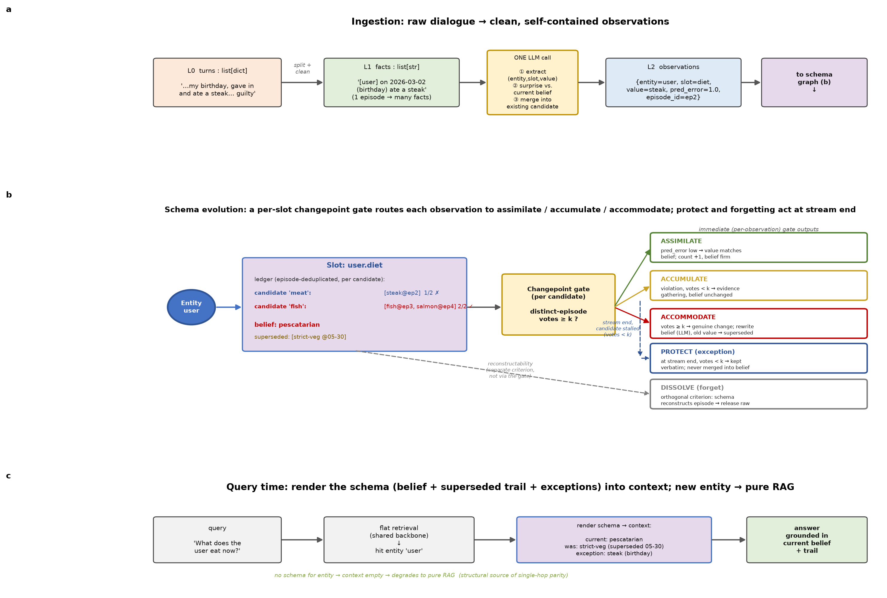

# SchemaMem

**Schema-memory-inspired long-term memory for LLM agents — distinguishing a genuine change from an isolated exception.**

As an LLM agent runs over weeks or months, it must turn a stream of experience into a compact
model of what it knows about the people and facts it encounters. Existing systems approach this
memory-evolution problem with three separately-developed mechanisms — **consolidation** (merge by
similarity), **updating** (overwrite / supersede by recency), and **forgetting** (drop by
time / frequency / importance). We argue they share one root defect: none of them carries an
*expectation*, so each falls back on a surface proxy instead of asking the one question that
matters when new evidence conflicts with an old belief —

> *is this a genuine change to what's true, or an isolated exception to it?*

A system that overwrites treats every exception as a change; a system that smooths treats every
change as noise. **SchemaMem** answers the question directly with a single quantity — the
**prediction residual** of an observation against the current belief — and reads it along two axes:

|                | residual ≈ 0 (predictable) | residual high (violation) |
|----------------|----------------------------|---------------------------|
| **recurs**     | assimilate (confirm) / dissolve (redundant → forget) | **accommodate** — schema is wrong, rewrite the belief |
| **isolated**   | ↑ same                     | **protect** — real but not generalizable, keep verbatim as an exception |

The third outcome — *protect as exception* — is the one the surveyed landscape lacks. It is also
why "never commit a change on first contact" is not conservatism but a mathematical necessity: a
single observation cannot distinguish a permanent change from a one-off (their likelihoods are
identical), so at least two independent episodes are required to estimate persistence.

## Method



Each entity gets a **schema**: named **slots** (e.g. `diet`, `location`), each holding one current
belief plus a time-ordered **evidence ledger**. Ingestion cleans raw dialogue into self-contained,
time-anchored **observations** (one LLM call per chunk does extract + surprise + candidate merge);
a per-slot **changepoint gate** then routes each observation:

- **ASSIMILATE** — matches the belief; confirm it.
- **ACCUMULATE** — a violation, but its candidate value has `< k` independent-episode votes; gather evidence.
- **ACCOMMODATE** — a candidate reaches `k` votes → genuine change: rewrite the belief, push the old value onto a `superseded` trail.
- **PROTECT** — an isolated violation that never reaches `k` → keep it verbatim as an exception, never merged into the belief.
- **DISSOLVE** *(optional)* — a redundant observation the schema can already reconstruct (residual ≤ ε) → release the raw text.

At query time the schema renders into context as **current belief + superseded trail + protected
exceptions**. An entity with no schema yields empty context and the agent falls back to plain
retrieval — which is why single-hop factual questions structurally match a retrieval baseline
(a built-in falsification test: gains should concentrate on knowledge-update and exception
questions, not on single-hop).

## Install

Environment and dependencies are managed with [uv](https://docs.astral.sh/uv/).

```bash
uv sync                 # create .venv and install runtime + dev deps
uv run pytest           # run the test suite (core + system)
uv run examples/diet_dialogue.py   # offline end-to-end demo (scripted LLM)
```

## Configuration

`SchemaMemorySystem` makes one LLM call per ingested chunk through an
**OpenAI-compatible** chat endpoint (OpenAI, a gateway, or a local vLLM/Ollama server).
Configure it via the standard environment variables:

```bash
export OPENAI_BASE_URL="http://127.0.0.1:9908/v1"   # gateway root or .../v1 (both work)
export OPENAI_API_KEY="EMPTY"                        # any non-empty string for a local server
```

or pass `api_base=` / `api_key=` explicitly (these win over the env vars). The base
URL is auto-normalized to end in `/v1`. Tests and the offline demo inject a mock
client, so they need no endpoint and no key. Full details, model guidance and a local
vLLM recipe are in [docs/CONFIGURATION.md](docs/CONFIGURATION.md).

## Usage

```python
from schemamem import SchemaMemorySystem

mem = SchemaMemorySystem(
    model="Qwen3-8B",
    api_base="http://127.0.0.1:9908/v1",   # any OpenAI-compatible endpoint
    api_key="EMPTY",
    min_evidence_count=2,                   # k: episodes needed to accommodate
)

mem.add_chunk("I'm a strict vegetarian.")            # seeds belief diet = strict vegetarian
mem.add_chunk("Had a steak at my birthday dinner.")  # isolated violation -> pending
mem.add_chunk("I've started eating fish.")           # fish candidate, 1 vote
mem.add_chunk("Had a salmon salad today.")           # fish 2 votes -> accommodate

context, source_groups = mem.retrieve_with_source_groups("diet")
print(context)
# Entity: user
#   diet: pescatarian (current)
#   diet: strict vegetarian (was, superseded ...)
#   diet: ate meat (exception, ...)     <- the birthday steak, kept as an exception

answer = mem.ask_with_retrieved_context("What does the user eat now?", context)
```

For the offline, no-API-key path, pass a scripted `client=` (see `examples/diet_dialogue.py`).

### Optional modes (ablations, off by default)

- `online_decay=True, decay_window=N` — a stalled candidate becomes a protected exception *online*
  after `N` episodes without corroboration, instead of at a stream-end sweep (a CUSUM with a
  forgetting factor).
- `enable_forgetting=True` — turns on reconstruction-gated forgetting; `reconstruction_tolerance`
  is the residual ε below which a redundant observation's raw text is released.

## Layout

```
src/schemamem/
  core.py           # L3: entity graph + per-slot changepoint arbitration (no LLM, deterministic)
  prompts.py        # validated L1/L2 extraction + rewrite + answer prompts
  schema_memory.py  # SchemaMemorySystem: LLM ingestion + query rendering, the public API
tests/              # core (routing) + system (adapter contract) tests
examples/           # runnable offline demo
eval/               # MemoryData benchmark adapter + config + integration guide
docs/               # method architecture figure
```

## Status

Research code for an in-progress paper. The core arbitration engine is deterministic and
unit-tested; the LLM ingestion layer is validated end-to-end against an OpenAI-compatible endpoint.
Benchmark numbers are produced through the `eval/` MemoryData integration, not committed here.

## License

MIT — see [LICENSE](LICENSE).
